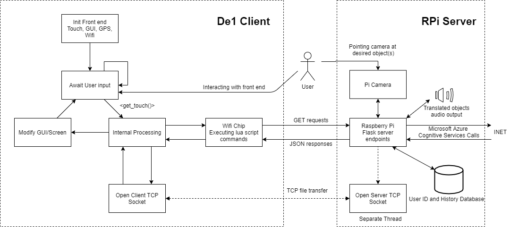
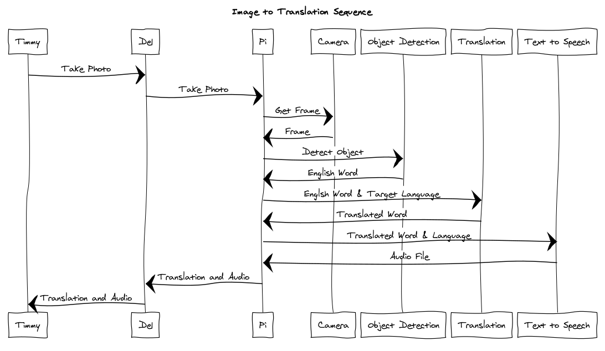
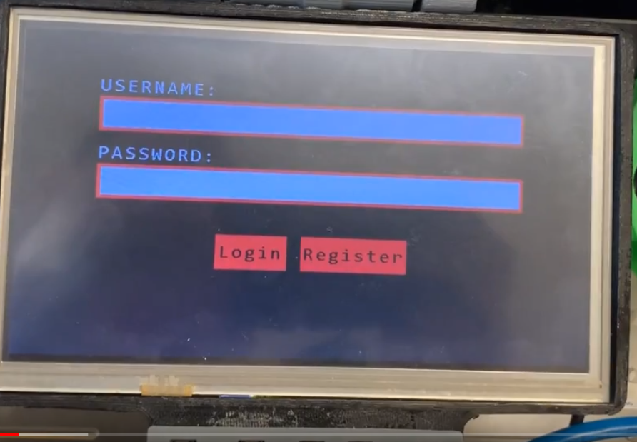
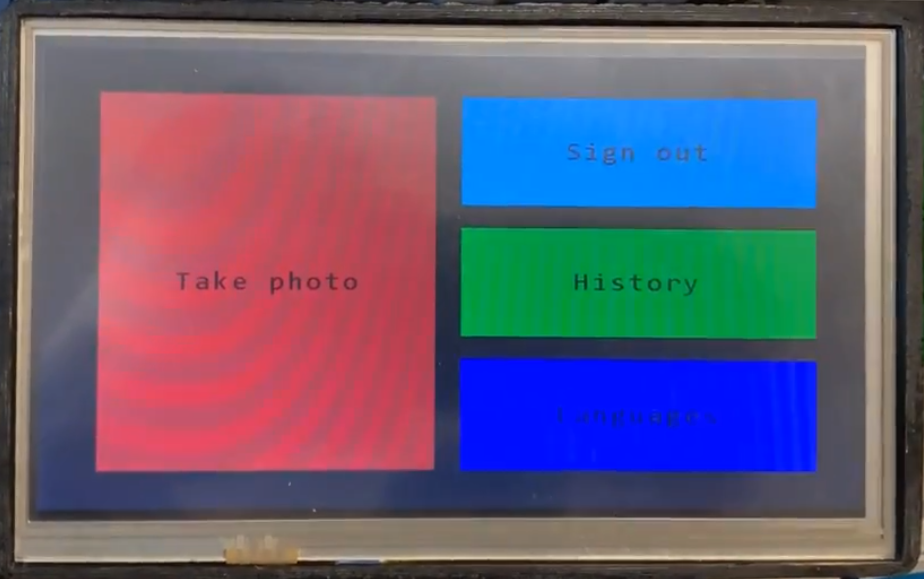
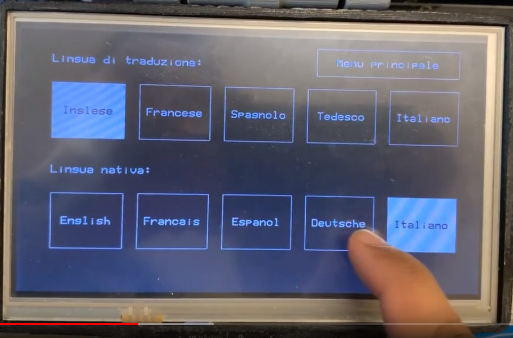
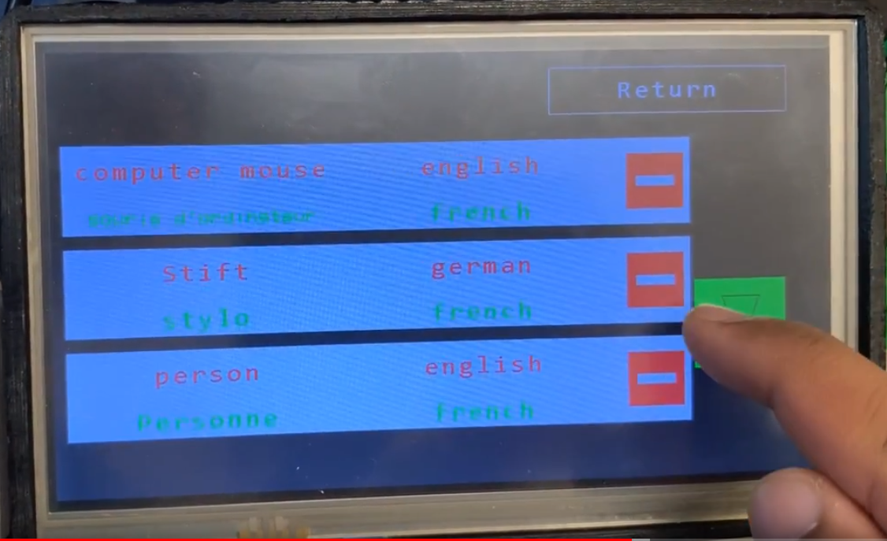
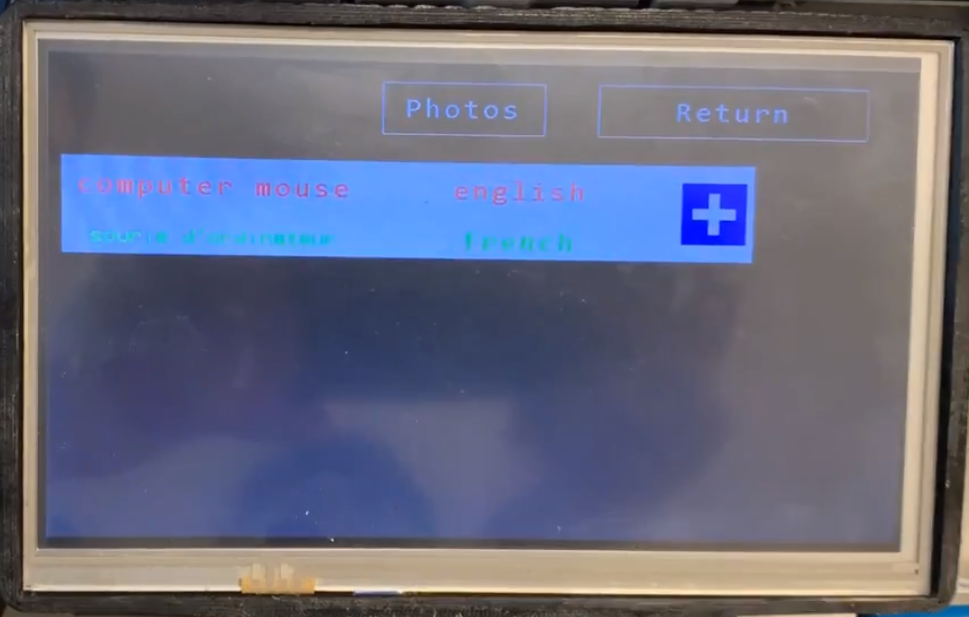
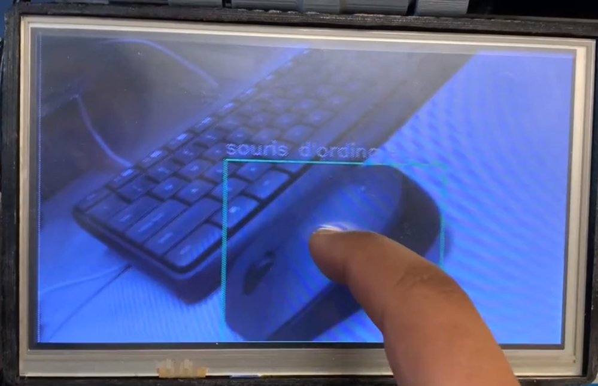

# Translaite

Translaite is a proof of concept application that allows users to improve their vocabulary in various languages, especially with respect to objects found near the user in their day-to-day lives.

Users can take images using the presented GUI on a touch screen, users can capture images of objects using a Raspberry Pi camera. The objects in the captured images are identified, translated and annotated before being sent back to the GUI for user inspection. Optionally, users can save and maintain translation histories as well as produce audio playbacks to support their progress with pronunciation.

## Index

- [Main Components](#main-components)
- [Hardware/Communication Structure](#hardwarecommunication-structure)
- [Software Architecture](#software-architecture)
- [System Information Flow](#system-information-flow)
- [GUI](#gui)
- [Project Members](#project-members)

## Main Components

- De1-SoC FPGA module
- Raspberry Pi 3B+
- Raspberry Pi Camera 2
- 7.0" 40-pin TFT Display - 800x480 with Touchscreen (Adafruit Part 2354), with associated cables
- AR1100 Resistive Touch Screen Controller chip
- Adafruit HUZZAH ESP8266 Breakout WiFi chip
- Adafruit Ultimate GPS Breakout V3 chip
- Audo output device that connects to Raspberry Pi

## Hardware/Communication Structure

Translaite runs on the De1-SoC platform, with I/O to and from a touch screen module, a WiFi chip for wireless functionality, as well as a GPS module. The display on the screen is supported by VGA output built into the De1-SoC. All other external communication to the above components is conducted through 32-bit serial connections. The De1-SoC is also connected to a Raspberry Pi via Ethernet, allowing for socket communication between the devices for image transfer.

The Raspberry Pi, in turn, is connected to a Raspberry Pi camera module, a device for audio output, as well as the aforementioned Ethernet cable.

## Software Architecture

Our application implemented a basic client-server architecture.

**Client:**  

- De1 running Linux utilized to create user interface (Yocto Linux console, De1-SoC distribution)
- Communicated to server using WiFi and Ethernet  

**Server:**  

- Raspberry Pi running a Flask Python server  
- Endpoints created to handle user authentication and translations requests  
- Stored user information in a MongoDB Database
- Utilized OpenCV Python library for image processing and drawing bounding boxes
- Communicated to Microsoft Cognitive services APIs for object recognition, translation, and text to speech services

## System Information Flow

The information moves through components as indicated by the arrows.

The sequence diagram below shows the timing of events relative to each other for translation and audio playback. History is dealt with similarly but there are no objects to the right side of the Pi, since the MongoDB database is maintained on the Raspberry Pi.

## GUI

All of the GUI uses the accelerated graphics functionality implemented using the FPGA component of the De1-SoC. All buttons and text are large and screen layouts are simple since the target audience in the long would most likely be young children, learning 2nd or 3rd languages.

The below is the login screen. A similar register screen is also available to set up new user profiles on the database.

The main screen is able to navigate to all other screens other than image capture and translated screens directly. This is because they only appear after a translation has been requested

There are 5 options, and text on all screens is localized to reflect the native language selected.

The history screen allows users browse their saved translations (max 3 items per page), play audio (by tapping on an entry in the white space), or remove items from their translation history by tapping the red minus button.

Once a translation is requested, translations for all detected objects are shown on the translated objects screen, with the options for audio playback as well as adding to user history.

The image capture screen appears after the "Photos" button is pressed on the translated objects screen. It shows all identified objects, boxes around them with annotations in the target language.

## Project Members

All names are linked to respective Github profiles. 

- [Eddy Maric](https://github.com/EddyMaric)
- [Nancy Jiang](https://github.com/jnancy)
- [Odin Mebesius](https://github.com/mebesius)
- [Shreyans Kulshrestha](https://github.com/ShreyansK2000)
- [Trent Walsh](https://github.com/trentwalsh2)